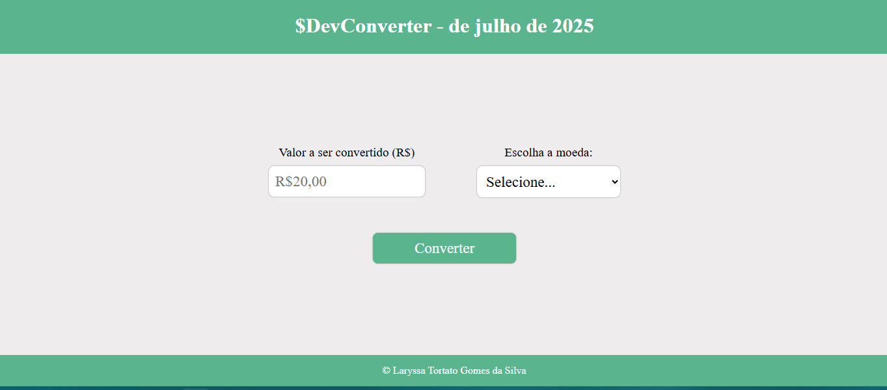

# Novo projeto

- conversão de moedas

</img>

Neste projeto, desenvolvi uma aplicação web de conversão de moedas utilizando HTML, CSS e JavaScript. O objetivo foi criar uma interface interativa e responsiva que permite ao usuário inserir um valor em reais (R$) e convertê-lo para a moeda desejada.

📋 Funcionalidades Implementadas:
✅ Layout responsivo com cabeçalho, formulário centralizado e rodapé fixo.
✅ Campo de entrada para valor em reais e seleção de moeda.
✅ Botão de conversão com resultado exibido em destaque.
✅ Animações visuais de fundo para dar dinamismo ao site.
✅ Rodapé com informações de autoria.
